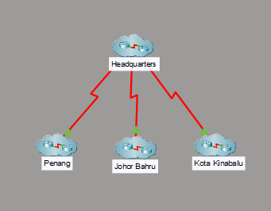
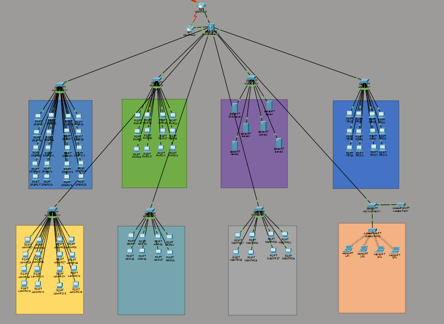
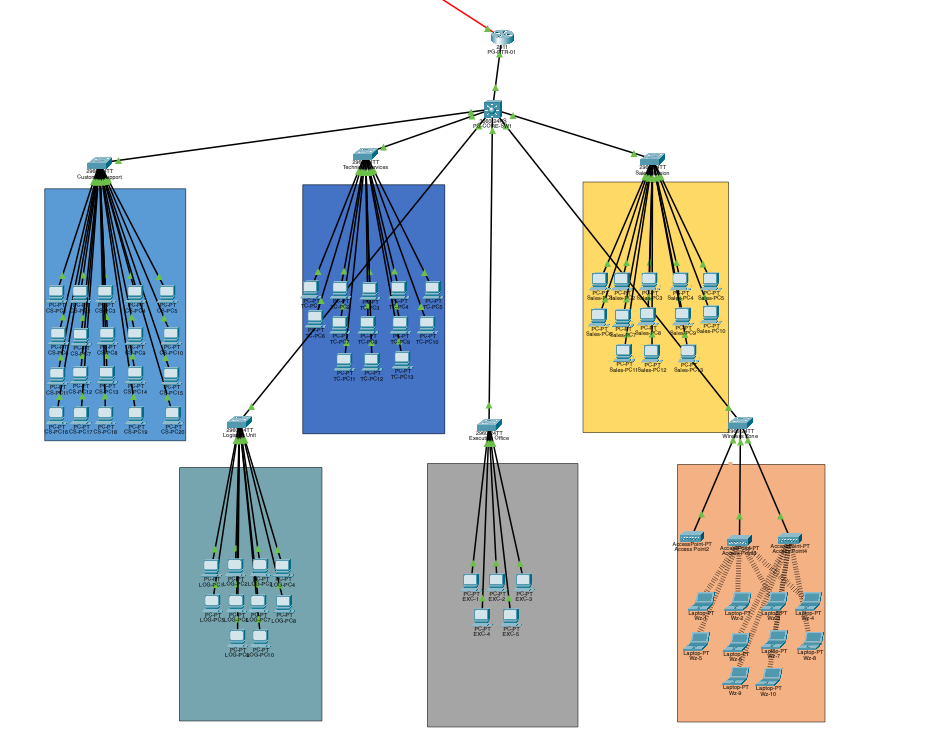
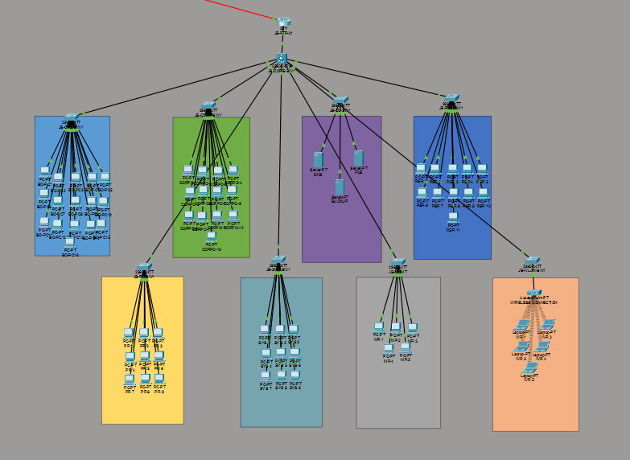
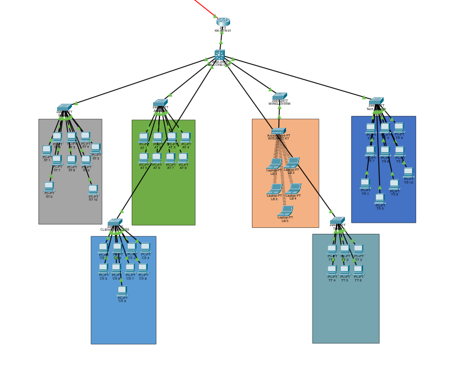

# Enterprise Multi-Branch Network

> A professionally documented enterprise network built using Cisco Packet Tracer.



---

# Overview

This project simulates a modern enterprise network consisting of four interconnected locations:

- Headquarters (Kuala Lumpur)
- Penang Branch
- Johor Bahru Branch
- Kota Kinabalu Branch

Originally developed as a university project, this network has evolved into **Project Zero** — an enterprise-grade networking portfolio focused on security hardening, standardized infrastructure, and realistic network design.

---

# Current Release

**Latest Stable Release:** `v0.2.0`

Current development is focused on **v0.3.0**, introducing:

- Private IPv4 addressing
- Centralized DHCP
- Enterprise infrastructure services

---

# Features

- Multi-site enterprise topology
- Department-based VLAN segmentation
- Layer 3 inter-VLAN routing
- Secure SSH device management
- Port Security on access ports
- BPDU Guard protection
- Native VLAN hardening
- Parking VLAN for unused ports
- Disabled Dynamic Trunking Protocol (DTP)
- Standardized enterprise naming conventions
- Version-controlled development using Git & GitHub

---

# Security Features

- SSH Version 2 management
- Local administrator authentication
- Encrypted device passwords
- Port Security with Sticky MAC learning
- BPDU Guard on user access ports
- Dedicated Parking VLAN for unused interfaces
- Native VLAN hardening
- Disabled Dynamic Trunking Protocol (DTP)

---

# Network Overview

## Enterprise WAN


---

## Headquarters



---

## Penang Branch



---

## Johor Bahru Branch



---

## Kota Kinabalu Branch



---

# Project Structure

```text
enterprise-multi-branch-network/

├── images/
│   ├── overview.png
│   ├── headquarters.png
│   ├── penang.png
│   ├── johor.png
│   └── kota.png
│
├── packet-tracer/
│   ├── enterprise-network-v1.0-original.pkt
│   └── enterprise-network-v0.2.0.pkt
│
└── README.md
```

---

# Technologies

- Cisco Packet Tracer 9
- Cisco IOS
- VLANs
- IEEE 802.1Q Trunking
- Inter-VLAN Routing
- SSH
- Spanning Tree Protocol (STP)
- Port Security
- Git
- GitHub

---

# Development Roadmap

## ✅ v0.1.0

- Enterprise topology redesign
- Professional branch layouts
- Standardized device naming
- Improved visual consistency
- GitHub repository
- Project documentation

---

## ✅ v0.2.0

- Headquarters security hardening
- SSH management
- Local user authentication
- Port Security
- BPDU Guard
- Parking VLAN implementation
- Native VLAN hardening
- Disabled Dynamic Trunking Protocol (DTP)

---

## 🚧 v0.3.0 (In Progress)

- Private IPv4 addressing
- DHCP deployment
- Infrastructure services
- DNS
- NTP

---

## Planned

- Enterprise-wide OSPF deployment
- Access Control Lists (ACLs)
- Branch security rollout
- Syslog server
- FTP/TFTP server
- Enterprise monitoring
- Final network validation

---

# Version History

| Version | Description |
|----------|-------------|
| v0.1.0 | Enterprise topology redesign |
| v0.2.0 | Headquarters security hardening |

---

# Author

**Cezar Abou Al Mouna**

Cybersecurity Student

GitHub: https://github.com/CezarSecurity